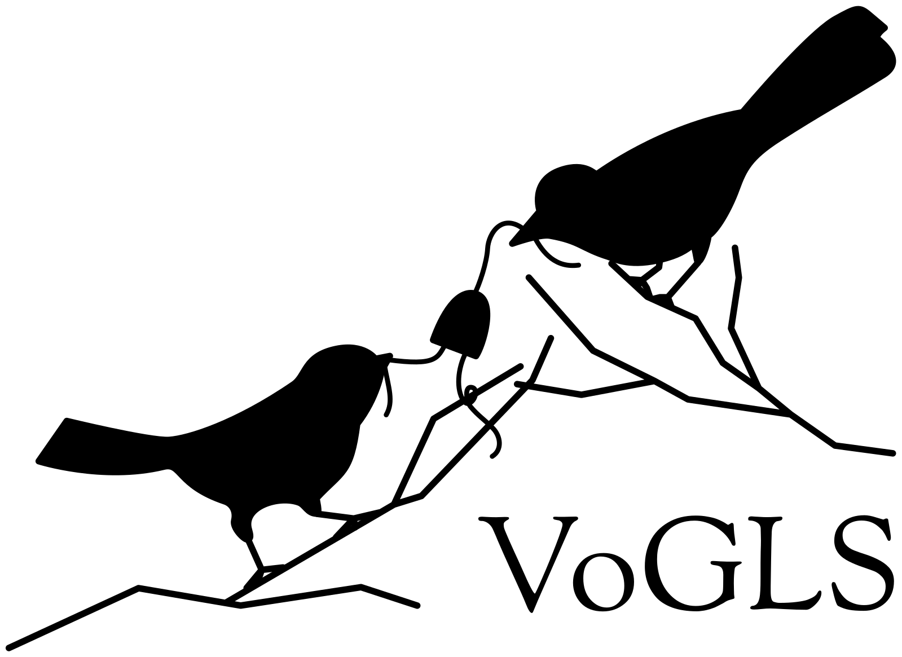

# Vogls



Vogls is a full-timing Verilog simulator focused on side-channel analysis,
interactive simulation and gate-level simulation.

## Installation

```
cargo install --git https://link.to.repo/
```

## Build

```
cargo build --release vogls
```

## Tests

```
cargo test
cargo run -p vogls-test --release
```