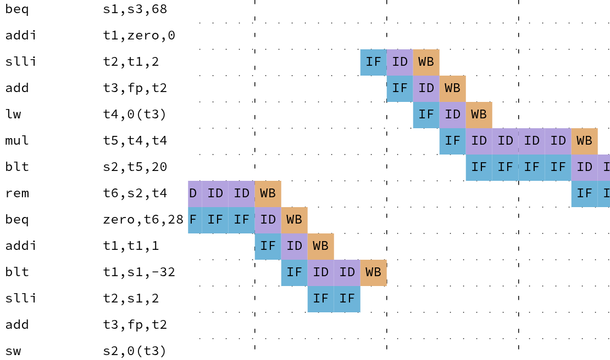

# Pipeline Explorer Web Application

<p align="center">
  
</p>

This is a web application to visualize the pipeline of RISC-V processors. It wraps the Vogls Verilog simulator to simulate several RISC-V cores and fetch the state of the pipeline at each cycle. Consequently, this is a real view into the pipeline and not an approximation. The site provides this application compiled to WebAssembly (meaning it runs locally on your device) and provides an assembler allowing you to change the executed program live in your browser.

# Build

There are three important commands:

```bash
cd .. && just wasm-release # Build the WebAssembly files
npm run dev                # Start a live refresh server for the web interface
npm run build              # Build and bundle the website
```
